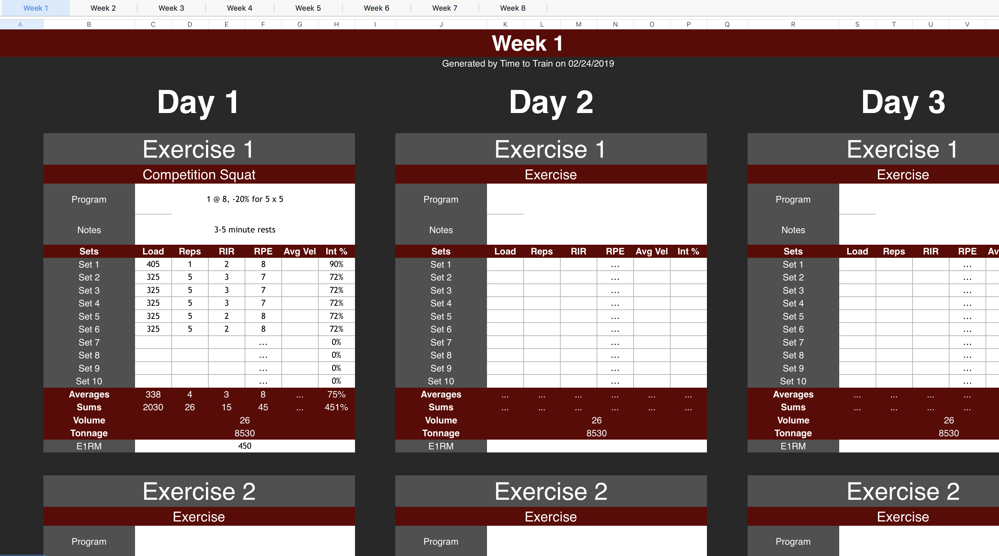

# Time to Train

A generator for customizable workout templates using spreadsheets.

This is a new project which will make it incredibly easy to create exercise programs.

```
$ ./timetotrain.py --weeks 8 --frequency 3 --slots 3 --sets 10 --filename train.xlsx
Writing sheet Week 1
Writing sheet Week 2
Writing sheet Week 3
Writing sheet Week 4
Writing sheet Week 5
Writing sheet Week 6
Writing sheet Week 7
Writing sheet Week 8
Writing program to train.xlsx
```



## Install

```
pip3 install openpyxl
git clone https://github.com/jonschipp/timetotrain
```

## Metrics

The generated template includes the following metrics.

* Sums for Load, Reps, RIR, RPE, Avg Velocity, and Int % - calculated per exercise slot
* Averages for Load, Reps, RIR, RPE, Avg Velocity, and Int % - calculated per exercise slot
* Volume (Sets x Reps) - calculated per exercise slot
* Tonnage (Sets x Reps x Load) - calculated per exercise slot
* E1RM - manual input
* Intensity Percentage per set (Int % of E1RM) - Requires manual E1RM input
* Session RPE - manual input
* Average RPE - Average RPE of all exercises slots in a day

More to come!
